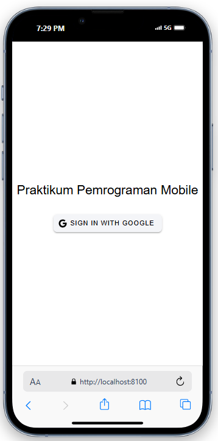
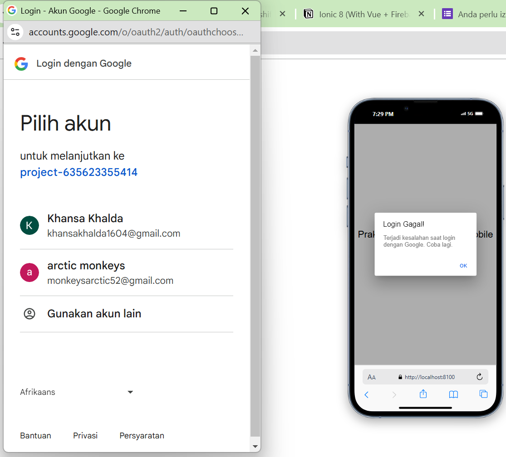
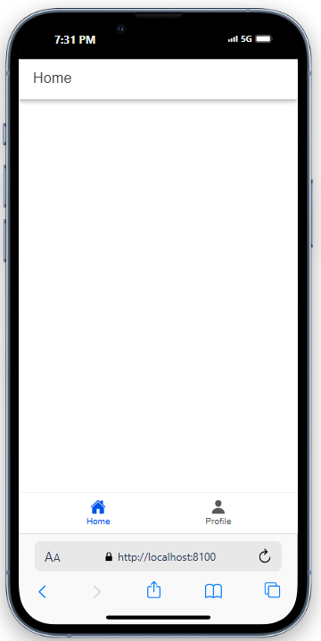
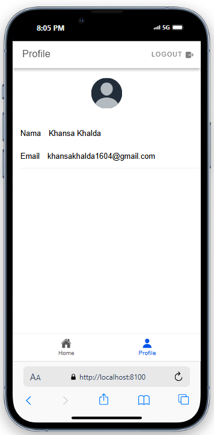
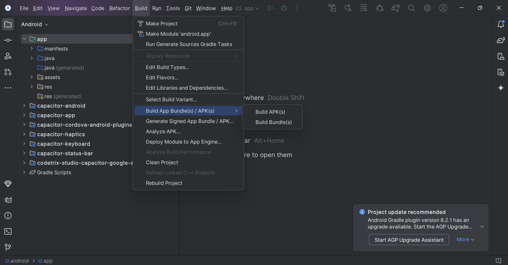
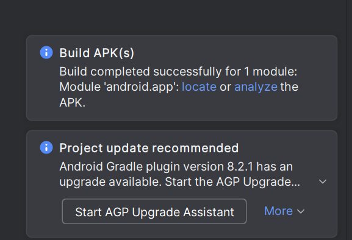
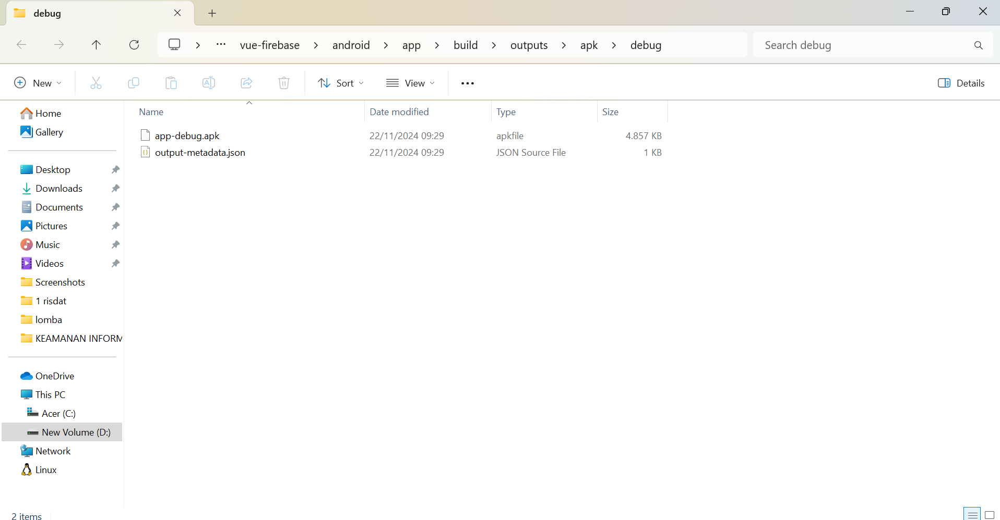

# Dokumentasi Aplikasi Ionic dengan Google Authentication

Aplikasi ini menggunakan Ionic, Vue, dan Firebase untuk autentikasi login melalui akun Google. Berikut adalah langkah-langkah proses autentikasi dan penjelasan bagaimana aplikasi mendapatkan username dan profil pengguna dari akun Google.

## 1. Tampilan Halaman Login



- **Penjelasan**: Tampilan awal halaman login dengan tombol "Sign in with Google." Pengguna perlu menekan tombol ini untuk memulai proses autentikasi menggunakan akun Google.

## 2. Tampilan Pilihan Akun Google



- **Penjelasan**: Setelah pengguna menekan tombol "Sign in with Google," aplikasi akan membuka halaman login Google. Pengguna kemudian memilih akun Google yang akan digunakan untuk login ke dalam aplikasi.

## 3. Tampilan Halaman Utama (Home)



- **Penjelasan**: Ini adalah halaman utama aplikasi setelah login. Pengguna bisa berpindah ke tab profil untuk melihat data profil yang sudah diperoleh dari akun Google.

## 4. Tampilan Profil Pengguna



- **Penjelasan**: Setelah berhasil login, aplikasi menampilkan halaman profil yang memuat nama dan email pengguna. Data ini diperoleh dari akun Google yang digunakan untuk login. Foto profil juga ditampilkan berdasarkan URL foto yang diambil dari data akun Google.

---

## Cara Kerja Autentikasi dengan Google

### Langkah 1: Inisialisasi Google Authentication

1. Aplikasi menggunakan Firebase untuk mengatur autentikasi dengan Google.
2. Saat aplikasi dimulai, Firebase diinisialisasi dengan `firebaseConfig`, yang berisi konfigurasi proyek Firebase.

### Langkah 2: Proses Login

1. Ketika pengguna menekan tombol "Sign in with Google," aplikasi menggunakan GoogleAuth untuk membuka halaman login Google.
2. Pengguna memilih akun yang ingin digunakan, dan Firebase mengautentikasi pengguna tersebut.
3. Setelah berhasil login, Firebase akan mengembalikan data pengguna seperti `displayName`, `email`, dan `photoURL`.

### Langkah 3: Mendapatkan dan Menampilkan Data Profil

1. Data yang diterima dari Firebase (`displayName`, `email`, dan `photoURL`) disimpan dalam store (`authStore`).
2. Pada halaman profil, data pengguna yang tersimpan ditampilkan dengan menggunakan binding Vue untuk memperbarui UI secara otomatis.

Berikut adalah lanjutan untuk file `README.md` yang mencakup dokumentasi CRUD dengan screenshot yang Anda minta, beserta penjelasan masing-masing:

---

## Dokumentasi CRUD Firebase di Aplikasi

Aplikasi ini memiliki fitur CRUD (Create, Read, Update, Delete) menggunakan Firebase Firestore. Berikut adalah penjelasan fitur CRUD dengan screenshot untuk memperjelas implementasinya.

Berikut penjelasan untuk masing-masing gambar:

---

### 1. Tampilan Halaman Login


- **Penjelasan**:
  - Ini adalah halaman awal aplikasi. Pengguna akan melihat tombol "Sign in with Google."
  - Tombol ini digunakan untuk memulai proses autentikasi menggunakan akun Google.
  - Ketika tombol ini ditekan, pengguna akan diarahkan ke halaman login Google untuk memilih akun yang akan digunakan.

---

### 2. Tampilan Profil Pengguna


- **Penjelasan**:
  - Halaman ini menampilkan data profil pengguna setelah berhasil login.
  - Data yang ditampilkan meliputi nama pengguna dan email, yang diambil dari akun Google yang digunakan saat login.
  - Foto profil pengguna akan ditampilkan jika tersedia, atau inisial nama pengguna akan digunakan sebagai placeholder.
  - Tombol "Logout" di kanan atas memungkinkan pengguna untuk keluar dari aplikasi.

---

### 3. Tampilan Halaman Utama (Home)


- **Penjelasan**:
  - Halaman ini adalah halaman utama aplikasi yang menampilkan daftar tugas pengguna.
  - Tugas aktif ditampilkan di bagian atas dengan informasi waktu pembaruan terakhir.
  - Bagian "Completed" menyimpan daftar tugas yang telah selesai.
  - Tombol biru dengan ikon "+" digunakan untuk menambahkan tugas baru.

---

### 4. Tampilan Modal Tambah Data


- **Penjelasan**:
  - Modal ini muncul ketika tombol "+" di halaman utama ditekan.
  - Pengguna dapat mengisi judul (`Title`) dan deskripsi (`Description`) tugas yang ingin ditambahkan.
  - Tombol "Add Todo" akan menyimpan data tugas ke Firebase Firestore dan menutup modal jika data valid.

---

### 5. Notifikasi Berhasil Menambahkan Data


- **Penjelasan**:
  - Setelah tugas berhasil ditambahkan, aplikasi menampilkan notifikasi "Todo added successfully" di bagian atas layar.
  - Tugas baru juga langsung ditambahkan ke daftar tugas di halaman utama, dengan waktu terakhir diperbarui yang terlihat di bawah deskripsi.

---

### 6. Tampilan Tombol Edit Data


- **Penjelasan**:
  - Setiap item tugas memiliki tombol edit (ikon pena biru) yang memungkinkan pengguna untuk memperbarui informasi tugas.
  - Ketika tombol ini ditekan, modal edit akan terbuka dengan data tugas yang dipilih telah terisi sebelumnya.

---

### 7. Tampilan Modal Edit Data


- **Penjelasan**:
  - Modal ini muncul ketika pengguna memilih untuk mengedit tugas dengan menekan tombol edit.
  - Pengguna dapat memperbarui judul (`Title`) dan deskripsi (`Description`) tugas.
  - Tombol "Edit Todo" akan menyimpan perubahan ke Firebase Firestore dan menutup modal jika data valid.

---

### 8. Notifikasi Berhasil Mengedit Data


- **Penjelasan**:
  - Setelah data tugas berhasil diperbarui, aplikasi menampilkan notifikasi "Todo updated successfully" di bagian atas layar.
  - Tugas yang telah diperbarui akan langsung terlihat di daftar tugas pada halaman utama, dengan waktu terakhir diperbarui ditampilkan di bawah deskripsi.

---

### 9. Tampilan Tombol Complete


- **Penjelasan**:
  - Setiap tugas memiliki tombol complete (ikon centang hijau) yang dapat ditekan untuk menandai tugas tersebut sebagai selesai.
  - Ketika tombol ini ditekan, status tugas akan diperbarui menjadi "Completed" di database.

---

### 10. Notifikasi Berhasil Complete


- **Penjelasan**:
  - Setelah tugas berhasil ditandai sebagai selesai, aplikasi menampilkan notifikasi "Todo marked as completed" di bagian atas layar.
  - Tugas yang selesai secara otomatis dihapus dari daftar tugas aktif.

---

### 11. Tampilan Setelah Tugas Berhasil Complete


- **Penjelasan**:
  - Setelah tugas ditandai sebagai selesai, tugas akan dipindahkan ke bagian "Completed" di halaman utama.
  - Pengguna dapat melihat detail tugas yang telah selesai di bawah tab "Completed," termasuk waktu terakhir diperbarui.

---

### 12. Tampilan Tombol Active Kembali


- **Penjelasan**:
  - Pada bagian "Completed," setiap tugas memiliki tombol active kembali (ikon silang kuning) yang dapat ditekan untuk mengembalikan tugas ke daftar aktif.
  - Tombol ini memungkinkan pengguna untuk memindahkan tugas yang sudah selesai kembali ke daftar tugas aktif jika diperlukan.

---

### 13. Notifikasi Berhasil Active Kembali


- **Penjelasan**:
  - Setelah tombol active kembali ditekan, aplikasi menampilkan notifikasi "Todo marked as active" di bagian atas layar.
  - Tugas yang dikembalikan akan muncul kembali di daftar tugas aktif, dan daftar "Completed" akan diperbarui untuk mencerminkan perubahan tersebut.

---

## 14. Tampilan Tombol Hapus Todo


- **Penjelasan**: Pengguna dapat menghapus todo yang telah dibuat dengan menggeser todo ke kiri. Tombol hapus berwarna merah akan muncul, dan pengguna dapat menekan tombol ini untuk menghapus todo.

---

## 15. Todo Berhasil Dihapus


- **Penjelasan**: Setelah tombol hapus ditekan, todo yang dipilih akan dihapus dari daftar, dan notifikasi hijau akan muncul dengan pesan "Todo deleted successfully."

---

## 16. Tampilan Setelah Todo Terhapus


- **Penjelasan**: Jika tidak ada todo yang tersisa setelah penghapusan, daftar akan kosong dengan pesan "No active todos" dan "No completed todos."

---

## 17. Notifikasi Ketika Menekan "Add Todo" Tanpa Input Data


- **Penjelasan**: Jika pengguna mencoba menambahkan todo tanpa memasukkan data pada form, sistem akan menampilkan notifikasi peringatan berwarna kuning dengan pesan "Title is required."

## Cara Build Aplikasi Ionic ke Format APK

### Langkah 1: Build Aplikasi Ionic

1. Jalankan perintah berikut di terminal untuk membangun aplikasi Ionic:

   ```bash
   ionic build
   ```

   - Proses ini menghasilkan folder `dist` yang berisi aset web aplikasi Anda.

2. Pastikan Anda telah menginstal dependensi untuk Capacitor. Jika ada konflik, gunakan perintah berikut untuk memperbarui dependensi:

   ```bash
   npm install @capacitor/core@^6.2.0
   npm install @capacitor/android
   ```

3. Tambahkan platform Android ke proyek Ionic Anda:

   ```bash
   npx cap add android
   ```

4. Sinkronisasi web asset ke proyek Android:
   ```bash
   npx cap sync android
   ```

### Langkah 2: Buka Proyek di Android Studio

1. Buka proyek Android dengan perintah:
   ```bash
   npx cap open android
   ```
   - Perintah ini akan membuka Android Studio dengan proyek `android`.

### Langkah 3: Build APK di Android Studio

1. Setelah Android Studio terbuka, buka menu **Build** di toolbar.
2. Pilih opsi **Build Bundle(s) / APK(s)** -> **Build APK(s)**.

   - **Screenshot**:
     

3. Tunggu hingga proses build selesai. Android Studio akan menampilkan notifikasi bahwa APK telah berhasil dibuat.

   - **Screenshot**:
     

4. Klik **Locate** pada notifikasi untuk membuka folder tempat file APK berada.

### Langkah 4: Temukan File APK

1. Navigasikan ke folder berikut di proyek Anda:
   ```
   android/app/build/outputs/apk/debug
   ```
2. Anda akan menemukan file **app-debug.apk** di dalam folder tersebut.
   - **Screenshot**:
     

### Langkah 5: Instal APK di Perangkat Android

1. Pindahkan file `app-debug.apk` ke perangkat Android.
2. Instal file APK di perangkat menggunakan file explorer atau aplikasi transfer file.
3. Jalankan aplikasi setelah instalasi selesai.

### Catatan

- Karena format file APK hanya untuk Android, dan pengguna iPhone hanya bisa akses file dalam format **.IPA**, maka dari itu, mohon maaf saya belum bisa memberikan screenshoot hasil-nya.
